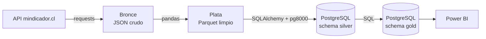
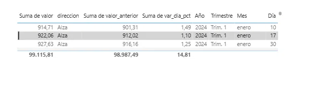
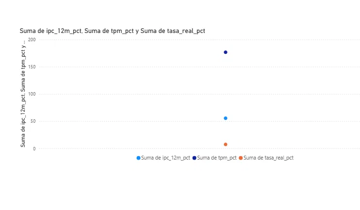
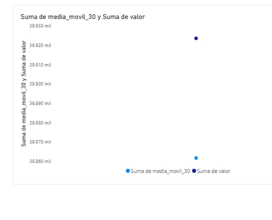
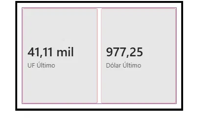

# Observatorio Económico de Chile

Pipeline de datos de punta a punta que extrae indicadores económicos chilenos desde una API pública, los limpia, los modela en PostgreSQL con arquitectura medallion (bronce / plata / oro) y los expone en un dashboard de Power BI con KPIs de mercado.

> **Autor:** Alejandro Martínez · Ingeniero en Informática · Datos y Automatización
> **Contacto:** [LinkedIn](https://www.linkedin.com/in/TU-PERFIL) · [GitHub](https://github.com/AMG2003)

---

## Objetivo

Construir un flujo reproducible que cubra el ciclo completo de datos:

1. **Ingeniería de datos:** ingesta desde API, capas de datos y carga a base de datos.
2. **Análisis de datos:** modelado en SQL, KPIs financieros y dashboard.
3. **Automatización:** ejecución de todo el pipeline con un solo comando.

## Arquitectura



| Capa | Qué contiene | Tecnología |
|---|---|---|
| **Bronce** | Respuesta de la API tal como llega, un JSON por indicador y año | Python, `requests` |
| **Plata** | Datos tabulares, tipados, sin duplicados y validados | Python, `pandas`, Parquet |
| **Oro** | Dimensiones y tablas de KPIs listas para consumir | PostgreSQL (SQL) |
| **Consumo** | Dashboard con modelo estrella | Power BI |

## Fuente de datos

[mindicador.cl](https://mindicador.cl): API pública y gratuita, sin clave. Indicadores utilizados:

- **Dólar observado** y **UF** (series diarias)
- **UTM**, **IPC** y **TPM** (series mensuales)

La extracción se hace por año (`/api/{indicador}/{yyyy}`) para contar con historia suficiente para variaciones anuales.

## KPIs (capa oro)

**Dólar y UF** (`gold.kpi_diarios`)
- Variación diaria, a 30 días y a 12 meses
- Medias móviles de 7 y 30 observaciones
- Volatilidad a 30 días anualizada
- Máximo y mínimo de 52 semanas

**Macroeconomía mensual** (`gold.macro_mensual`)
- IPC mensual e inflación acumulada a 12 meses
- TPM
- **Tasa real** (ecuación de Fisher): `(1 + TPM) / (1 + inflación 12m) - 1`
- Dólar promedio y de cierre, UF y UTM

**Alertas** (`gold.v_alertas_dolar`)
- Días con movimientos del dólar de 1% o más

**Dimensiones:** `gold.dim_indicador` y `gold.dim_fecha` (calendario).

## Estructura del proyecto

```
observatorio/
├── bronze_extract.py     # API -> JSON crudo (bronce)
├── silver_transform.py   # JSON -> Parquet limpio (plata)
├── load_postgres.py      # Parquet -> PostgreSQL y construcción de gold
├── run_pipeline.py       # Ejecuta las tres etapas en orden
├── sql/
│   └── gold.sql          # Dimensiones, KPIs y vista de alertas
├── docs/                 # Capturas del dashboard
├── requirements.txt
├── .env.example          # Plantilla de variables de entorno
└── .gitignore            # Excluye .env y data/
```

## Cómo ejecutarlo

**Requisitos:** Python 3.10+, PostgreSQL y Power BI Desktop.

```bash
# 1. Clonar e instalar dependencias
git clone https://github.com/AMG2003/observatorio-economico.git
cd observatorio-economico
pip install -r requirements.txt

# 2. Crear la base de datos en PostgreSQL
#    (desde pgAdmin o psql)
#    CREATE DATABASE observatorio;

# 3. Configurar credenciales
cp .env.example .env      # luego editar .env con tu clave

# 4. Ejecutar el pipeline completo
python run_pipeline.py
```

Después, en Power BI Desktop: **Obtener datos → Base de datos PostgreSQL** → servidor `localhost`, base `observatorio`, y cargar las tablas del schema `gold`.

Las etapas también pueden ejecutarse por separado: `bronze_extract.py`, `silver_transform.py` y `load_postgres.py`.

## Decisiones de diseño

- **API en lugar de scraping:** una API entrega un formato estable y documentado. Un scraping depende del HTML de un sitio y se rompe cuando este cambia.
- **Duplicados por extracción más reciente:** bronce guarda cada corrida con marca de tiempo; plata conserva el dato de la extracción más nueva de cada `(indicador, fecha)`, porque indicadores como el IPC pueden corregirse.
- **Fechas normalizadas:** se convierten a hora de Chile y se truncan a día, ya que los indicadores no tienen hora.
- **Validaciones de calidad en plata:** el proceso se detiene si hay nulos en columnas obligatorias, duplicados o datos vacíos.
- **KPIs en SQL y no en el dashboard:** la lógica queda versionada en el repositorio y es auditable, en lugar de quedar dentro del archivo `.pbix`.
- **Carga idempotente:** plata se recarga completa dentro de una transacción, por lo que ejecutar el pipeline varias veces no duplica datos.
- **Driver `pg8000`:** driver de Python puro; evita problemas con bibliotecas compiladas bloqueadas por Smart App Control en Windows.

## Dashboard









## Próximos pasos

- [ ] Programar la ejecución diaria (GitHub Actions o Programador de tareas)
- [ ] Alertas por correo cuando el dólar se mueva sobre un umbral (Power Automate o Rocketbot)
- [ ] Pruebas automáticas para las validaciones de plata
- [ ] Agregar fuentes oficiales adicionales (CMF, Banco Central)

## Tecnologías

Python · pandas · SQLAlchemy · PostgreSQL · SQL (funciones de ventana) · Parquet · Power BI · DAX